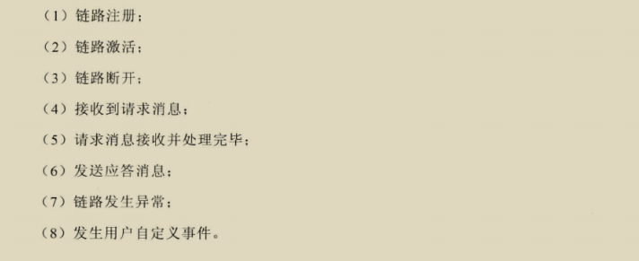
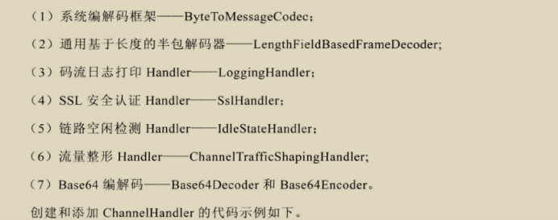

### 服务端创建

#### Channel

- ChannelPipeline 本质就是一个处理网络事件的职责链，负责管理和执行ChannelHandler。网络事件以事件流的形式在ChannelPipeline中流转，由ChannelPipeline 根据ChannelHandler 的执行策略调度ChannelHandler的执行
- 

- ChannelHandler 

  

