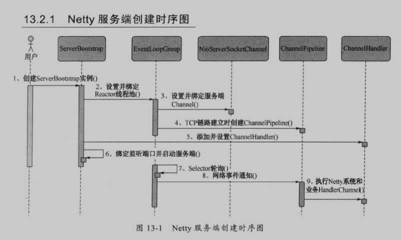

### 服务端创建

#### netty 服务端创建时序图

- ServerBootStrap Netty服务端的启动辅助类，提供一系列的方法用于设置服务端启动相关参数，底层通过`门面模式`对各种能力进行抽象和封装，以降低开发难度。无参构造器，由于参数太多而使用Builder模式

- Reactor线程池（Event Loop Group：是EventLoop的数组），EventLoop处理所有注册到本线程的多路复用器Selector上的channel，selector轮询操作由绑定的EventLoop线程run方法驱动，在一个循环体内循环执行。

  EventLoop职责不仅仅是处理网络IO事件，用户自定义task和定时任务也同意由EventLoop负责处理，这样线程模型就实现了统一

- Channel
- ChannelPipeline 本质就是一个处理网络事件的职责链，负责管理和执行ChannelHandler。网络事件以事件流的形式在ChannelPipeline中流转，由ChannelPipeline 根据ChannelHandler 的执行策略调度ChannelHandler的执行
- 

- ChannelHandler 

  