# Netty

## 学习Netty 

#### 什么是Netty ？

> Java 网络编程框架
>
> 使用：中间件、直播、社交、游戏等
>
> 知名开源软件（网络通信底层框架）：Dubbo、RocketMQ、Elasticsearch、HBase等

#### 为什么要学Netty？

- Netty高性能表现
- Netty中的重要组件
- Netty中内存池、对象池的设计
- Netty系统调优
- Netty 设计原理
  - IO模型
  - 内存管理
  - 线程模型
  - 数据结构
- 技术基础结构搭建，方便日后学习其它优秀框架
- 简化网络应用开发
  - Java NIO 的高级封装
  - TCP 粘包、拆包、数据编解码、TCP断线重连
- 由于Netty 的存在，Java语言由BIO->NIO ->Netty ,在网络领域终于可以与C++ 并肩存在

#### 学习目标& 困难

##### 困难

- 缺乏网络相关基础知识
- ~~Netty 知识点非常多，资源零散，不能系统化学习~~
- Netty 源码繁杂找不到方向
- 缺少实践、仅理论知识，容易忘记

##### 目标

- netty 基础
  - 了解netty 发展现状和技术架构
  - 核心组件原理和使用
  - 网络通信-编解码技术
- 进阶
  - 内存管理，对别Nginx、Redis
  - 高性能技术原理
- 实战开发
  - 高性能RPC 框架

## Netty 初识

#### 为什么选择Netty？

> 高效的网络应用NIO网络框架，简化了网络应用的开发过程
>
> 网络应用框架核心：
>
> - IO模型、线程模型和事件处理机制
> - 易用性API接口
> - 对数据协议、序列化的支持
>
> Netty 围绕核心要点做到尽善尽美，其健壮性、性能、可扩展性在通领域中做到首屈一指

##### 高性能，低延迟

> 实现高性能的网络应用框架离不开 I/O 模型问题，在了解 Netty 高性能原理之前我们需要先储备 I/O 模型的基本知识。
>
> I/O 请求可以分为两个阶段，分别为调用阶段和执行阶段。
>
> - 第一个阶段为I/O 调用阶段，即用户进程向内核发起系统调用。
>
> - 第二个阶段为I/O 执行阶段。此时，内核等待 I/O 请求处理完成返回。该阶段分为两个过程：首先等待数据就绪，并写入内核缓冲区；随后将内核缓冲区数据拷贝至用户态缓冲区。
>
> 

###### Linux IO模型

- 同步阻塞IO （BIO）

  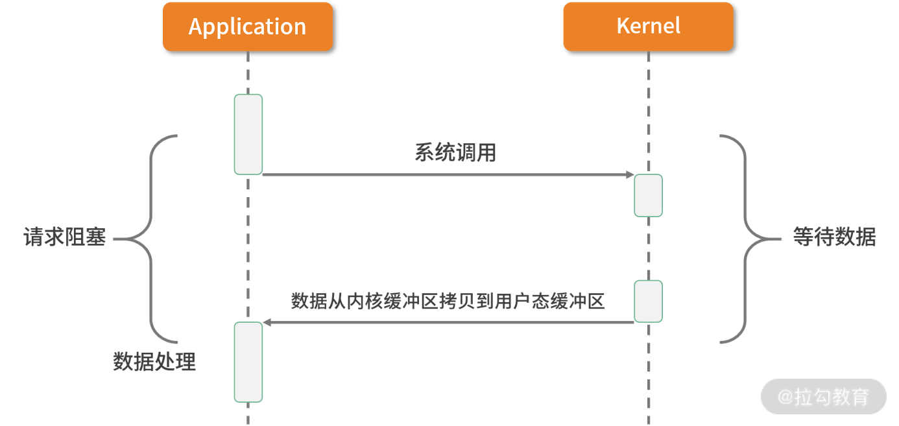

  > 应用进程向内核发起 I/O 请求，发起调用的线程一直等待内核返回结果。一次完整的 I/O 请求称为BIO（Blocking IO，阻塞 I/O），所以 BIO 在实现异步操作时，只能使用多线程模型，一个请求对应一个线程。但是，线程的资源是有限且宝贵的，创建过多的线程会增加线程切换的开销。

- 同步非阻塞IO （NIO）

  

  > 应用进程向内核发起 I/O 请求后不再会同步等待结果，而是会立即返回，通过轮询的方式获取请求结果。NIO 相比 BIO 虽然大幅提升了性能，但是轮询过程中大量的系统调用导致上下文切换开销很大。所以，单独使用非阻塞 I/O 时效率并不高，而且随着并发量的提升，非阻塞 I/O 会存在严重的性能浪费。

- IO 多路复用

  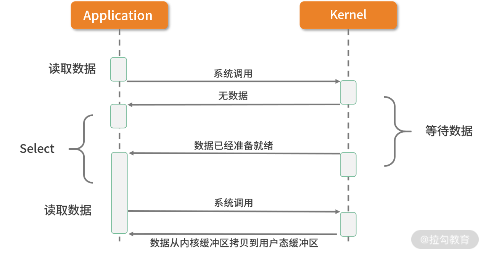

  > 多路复用实现了一个线程处理多个 I/O 句柄的操作。多路指的是多个数据通道，复用指的是使用一个或多个固定线程来处理每一个 Socket。select、poll、epoll 都是 I/O 多路复用的具体实现，线程一次 select 调用可以获取内核态中多个数据通道的数据状态。多路复用解决了同步阻塞 I/O 和同步非阻塞 I/O 的问题，是一种非常高效的 I/O 模型。

- 信号驱动 IO

  

  > 信号驱动 I/O 并不常用，它是一种半异步的 I/O 模型。在使用信号驱动 I/O 时，当数据准备就绪后，内核通过发送一个 SIGIO 信号通知应用进程，应用进程就可以开始读取数据了。

- 异步IO

  

  > 异步 I/O 最重要的一点是从内核缓冲区拷贝数据到用户态缓冲区的过程也是由系统异步完成，应用进程只需要在指定的数组中引用数据即可。异步 I/O 与信号驱动 I/O 这种半异步模式的主要区别：信号驱动 I/O 由内核通知何时可以开始一个 I/O 操作，而异步 I/O 由内核通知 I/O 操作何时已经完成。

###### Netty IO模型

- 基于非阻塞IO模型实现，底层依赖JDK NIO 框架多路复用器selector，一个多路复用器可以轮询多个channel，采用epoll 模式后，只需要一个线程负责轮询，就可以接入成千上万的客户端

- 在 I/O 多路复用的场景下，当有数据处于就绪状态后，需要一个事件分发器（Event Dispather），它负责将读写事件分发给对应的读写事件处理器（Event Handler）。事件分发器有两种设计模式：Reactor 和 Proactor，Reactor 采用同步 I/O， Proactor 采用异步 I/O
  Reactor 实现相对简单，适合处理耗时短的场景，对于耗时长的 I/O 操作容易造成阻塞。Proactor 性能更高，但是实现逻辑非常复杂，目前主流的事件驱动模型还是依赖 select 或 epoll 来实现。

  

  上图所描述的便是 Netty 所采用的主从 Reactor 多线程模型，所有的 I/O 事件都注册到一个 I/O 多路复用器上，当有 I/O 事件准备就绪后，I/O 多路复用器会将该 I/O 事件通过事件分发器分发到对应的事件处理器中。该线程模型避免了同步问题以及多线程切换带来的资源开销，真正做到高性能、低延迟。

##### 弥补了Java NIO 缺陷

- 易用性。 我们使用 JDK NIO 编程需要了解很多复杂的概念，比如 Channels、Selectors、Sockets、Buffers 等，编码复杂程度令人发指。相反，Netty 在 NIO 基础上进行了更高层次的封装，屏蔽了 NIO 的复杂性；Netty 封装了更加人性化的 API，统一的 API（阻塞/非阻塞） 大大降低了开发者的上手难度；与此同时，Netty 提供了很多开箱即用的工具，例如常用的行解码器、长度域解码器等，而这些在 JDK NIO 中都需要你自己实现。

- 稳定性。 Netty 更加可靠稳定，修复和完善了 JDK NIO 较多已知问题，例如臭名昭著的 select 空转导致 CPU 消耗 100%，TCP 断线重连，keep-alive 检测等问题。

- 可扩展性。 Netty 的可扩展性在很多地方都有体现，这里我主要列举其中的两点：一个是可定制化的线程模型，用户可以通过启动的配置参数选择 Reactor 线程模型；另一个是可扩展的事件驱动模型，将框架层和业务层的关注点分离。大部分情况下，开发者只需要关注 ChannelHandler 的业务逻辑实现。

##### 更低的资源消耗
作为网络通信框架，需要处理海量的网络数据，那么必然面临有大量的网络对象需要创建和销毁的问题，对于 JVM GC 并不友好。为了降低 JVM 垃圾回收的压力，Netty 主要采用了两种优化手段：

- 对象池复用技术。 Netty 通过复用对象，避免频繁创建和销毁带来的开销。

- 零拷贝技术。 除了操作系统级别的零拷贝技术外，Netty 提供了更多面向用户态的零拷贝技术，例如 Netty 在 I/O 读写时直接使用 DirectBuffer，从而避免了数据在堆内存和堆外内存之间的拷贝。

因为 Netty 不仅做到了高性能、低延迟以及更低的资源消耗，还完美弥补了 Java NIO 的缺陷，所以在网络编程时越来越受到开发者们的青睐。

## 纵览全局：把握Netty 整体架构脉络

#### 整体架构

>  Netty 是一个设计非常用心的网络基础组件，Netty 官网给出了有关 Netty 的整体功能模块结构，却没有其他更多的解释。从图中，我们可以清晰地看出 Netty 结构一共分为三个模块：
>
> 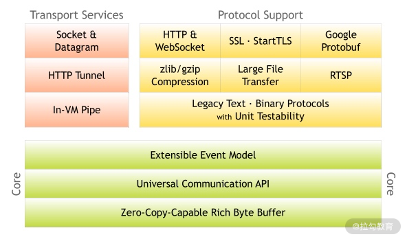
>
> 1. Core 核心层
>    Core 核心层是 Netty 最精华的内容，它提供了底层网络通信的通用抽象和实现，包括可扩展的事件模型、通用的通信 API、支持零拷贝的 ByteBuf 等。
>
> 2. Protocol Support 协议支持层
>    协议支持层基本上覆盖了主流协议的编解码实现，如 HTTP、SSL、Protobuf、压缩、大文件传输、WebSocket、文本、二进制等主流协议，此外 Netty 还支持自定义应用层协议。Netty 丰富的协议支持降低了用户的开发成本，基于 Netty 我们可以快速开发 HTTP、WebSocket 等服务。
> 3. Transport Service 传输服务层
>    传输服务层提供了网络传输能力的定义和实现方法。它支持 Socket、HTTP 隧道、虚拟机管道等传输方式。Netty 对 TCP、UDP 等数据传输做了抽象和封装，用户可以更聚焦在业务逻辑实现上，而不必关系底层数据传输的细节。
>
> Netty 的模块设计具备较高的通用性和可扩展性，它不仅是一个优秀的网络框架，还可以作为网络编程的工具箱。Netty 的设计理念非常优雅，值得我们学习借鉴。

#### Netty 逻辑架构

> 下图是 Netty 的逻辑处理架构。Netty 的逻辑处理架构为典型网络分层架构设计，共分为网络通信层、事件调度层、服务编排层，每一层各司其职。图中包含了 Netty 每一层所用到的核心组件。我将为你介绍 Netty 的每个逻辑分层中的各个核心组件以及组件之间是如何协调运作的。
> 

##### 网络通信层
> 网络通信层的职责是执行网络 I/O 的操作。它支持多种网络协议和 I/O 模型的连接操作。当网络数据读取到内核缓冲区后，会触发各种网络事件，这些网络事件会分发给事件调度层进行处理。
>
> 网络通信层的核心组件包含BootStrap、ServerBootStrap、Channel三个组件。
>
> - BootStrap & ServerBootStrap
>
> Bootstrap 是“引导”的意思，它主要负责整个 Netty 程序的启动、初始化、服务器连接等过程，它相当于一条主线，串联了 Netty 的其他核心组件。
>
> 如下图所示，Netty 中的引导器共分为两种类型：一个为用于客户端引导的 Bootstrap，另一个为用于服务端引导的 ServerBootStrap，它们都继承自抽象类 AbstractBootstrap。
> 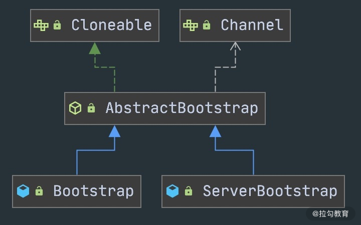
>
> Bootstrap 和 ServerBootStrap 十分相似，两者非常重要的区别在于 Bootstrap 可用于连接远端服务器，只绑定一个 EventLoopGroup。而 ServerBootStrap 则用于服务端启动绑定本地端口，会绑定两个 EventLoopGroup，这两个 EventLoopGroup 通常称为 Boss 和 Worker。
>
> ServerBootStrap 中的 Boss 和 Worker 是什么角色呢？它们之间又是什么关系？这里的 Boss 和 Worker 可以理解为“老板”和“员工”的关系。每个服务器中都会有一个 Boss，也会有一群做事情的 Worker。Boss 会不停地接收新的连接，然后将连接分配给一个个 Worker 处理连接。
>
> 有了 Bootstrap 组件，我们可以更加方便地配置和启动 Netty 应用程序，它是整个 Netty 的入口，串接了 Netty 所有核心组件的初始化工作。
>
> - Channel
>
> Channel 的字面意思是“通道”，它是网络通信的载体。Channel提供了基本的 API 用于网络 I/O 操作，如 register、bind、connect、read、write、flush 等。Netty 自己实现的 Channel 是以 JDK NIO Channel 为基础的，相比较于 JDK NIO，Netty 的 Channel 提供了更高层次的抽象，同时屏蔽了底层 Socket 的复杂性，赋予了 Channel 更加强大的功能，你在使用 Netty 时基本不需要再与 Java Socket 类直接打交道。
>
> 下图是 Channel 家族的图谱。AbstractChannel 是整个家族的基类，派生出 AbstractNioChannel、AbstractOioChannel、AbstractEpollChannel 等子类，每一种都代表了不同的 I/O 模型和协议类型。常用的 Channel 实现类有：
>
> 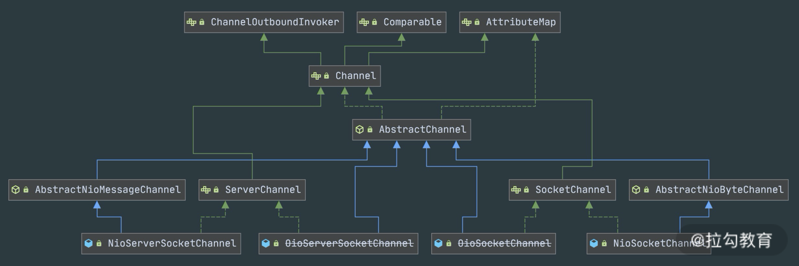
>
> - NioServerSocketChannel 异步 TCP 服务端。
>
> - NioSocketChannel 异步 TCP 客户端。
>
> - OioServerSocketChannel 同步 TCP 服务端。
>
> - OioSocketChannel 同步 TCP 客户端。
>
> - NioDatagramChannel 异步 UDP 连接。
>
> - OioDatagramChannel 同步 UDP 连接。
>
> 当然 Channel 会有多种状态，如连接建立、连接注册、数据读写、连接销毁等。随着状态的变化，Channel 处于不同的生命周期，每一种状态都会绑定相应的事件回调，下面的表格我列举了 Channel 最常见的状态所对应的事件回调。
>
> | 事件                | 说明                                          |
> | ------------------- | --------------------------------------------- |
> | channelRegistered   | Channel 创建后被注册到 EventLoop 上           |
> | channelUnregistered | Channel 创建后未注册或者从 EventLoop 取消注册 |
> | channelActive       | Channel 处于就绪状态，可以被读写              |
> | channelInactive     | Channel 处于非就绪状态                        |
> | channelRead         | Channel 可以从远端读取到数据                  |
> | channelReadComplete | Channel 读取数据完成                          |
>
> 有关网络通信层我就先介绍到这里，简单地总结一下。BootStrap 和 ServerBootStrap 分别负责客户端和服务端的启动，它们是非常强大的辅助工具类；Channel 是网络通信的载体，提供了与底层 Socket 交互的能力。那么 Channel 生命周期内的事件都是如何被处理的呢？那就是 Netty 事件调度层的工作职责了。

#### 事件调度层

> 事件调度层的职责是通过 Reactor 线程模型对各类事件进行聚合处理，通过 Selector 主循环线程集成多种事件（ I/O 事件、信号事件、定时事件等），实际的业务处理逻辑是交由服务编排层中相关的 Handler 完成。
>
> 事件调度层的核心组件包括 EventLoopGroup、EventLoop。
>
> - EventLoopGroup & EventLoop
>
> EventLoopGroup 本质是一个线程池，主要负责接收 I/O 请求，并分配线程执行处理请求。在下图中，我为你讲述了 EventLoopGroups、EventLoop 与 Channel 的关系。
>
> 
>
> 从上图中，我们可以总结出 EventLoopGroup、EventLoop、Channel 的几点关系。
>
> 1. 一个 EventLoopGroup 往往包含一个或者多个 EventLoop。EventLoop 用于处理 Channel 生命周期内的所有 I/O 事件，如 accept、connect、read、write 等 I/O 事件。
>
> 2. EventLoop 同一时间会与一个线程绑定，每个 EventLoop 负责处理多个 Channel。
>
> 3. 每新建一个 Channel，EventLoopGroup 会选择一个 EventLoop 与其绑定。该 Channel 在生命周期内都可以对 EventLoop 进行多次绑定和解绑。
>
> 下图是 EventLoopGroup 的家族图谱。可以看出 Netty 提供了 EventLoopGroup 的多种实现，而且 EventLoop 则是 EventLoopGroup 的子接口，所以也可以把 EventLoop 理解为 EventLoopGroup，但是它只包含一个 EventLoop 。
>
> 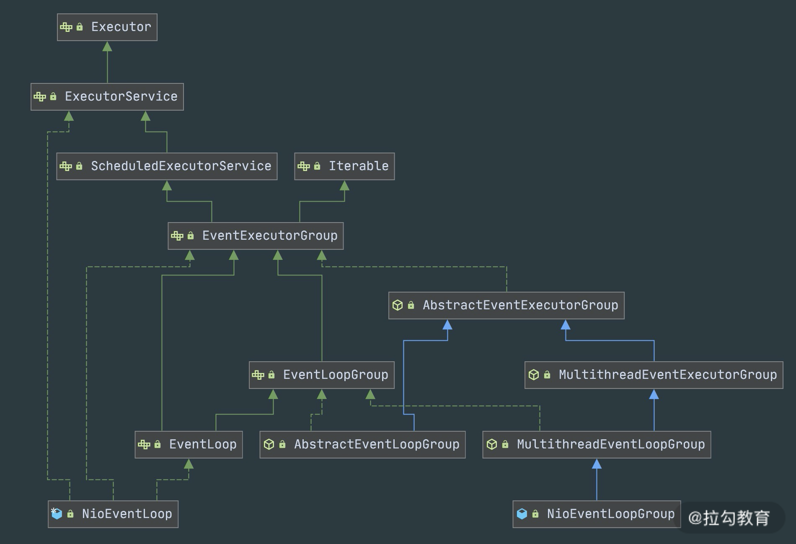

EventLoopGroup 的实现类是 NioEventLoopGroup，NioEventLoopGroup 也是 Netty 中最被推荐使用的线程模型。NioEventLoopGroup 继承于 MultithreadEventLoopGroup，是基于 NIO 模型开发的，可以把 NioEventLoopGroup 理解为一个线程池，每个线程负责处理多个 Channel，而同一个 Channel 只会对应一个线程。

EventLoopGroup 是 Netty 的核心处理引擎，那么 EventLoopGroup 和之前课程所提到的 Reactor 线程模型到底是什么关系呢？其实 EventLoopGroup 是 Netty Reactor 线程模型的具体实现方式，Netty 通过创建不同的 EventLoopGroup 参数配置，就可以支持 Reactor 的三种线程模型：

1. 单线程模型：EventLoopGroup 只包含一个 EventLoop，Boss 和 Worker 使用同一个EventLoopGroup；

2. 多线程模型：Boss 使用一个独立的eventLoopGroup, eventLoopGroup只包含一个eventLoop，Worker 使用一个EventLoopGroup,EventLoopGroup 包含多个 EventLoop；

3. 主从多线程模型：EventLoopGroup 包含多个 EventLoop，Boss 是主 Reactor，Worker 是从 Reactor，它们分别使用不同的 EventLoopGroup，主 Reactor 负责新的网络连接 Channel 创建，然后把 Channel 注册到从 Reactor。

#### 服务编排层
> 服务编排层的职责是负责组装各类服务，它是 Netty 的核心处理链，用以实现网络事件的动态编排和有序传播。
>
> 服务编排层的核心组件包括 ChannelPipeline、ChannelHandler、ChannelHandlerContext。
>
> - ChannelPipeline
>
> ChannelPipeline 是 Netty 的核心编排组件，负责组装各种 ChannelHandler，实际数据的编解码以及加工处理操作都是由 ChannelHandler 完成的。ChannelPipeline 可以理解为ChannelHandler 的实例列表——内部通过双向链表将不同的 ChannelHandler 链接在一起。当 I/O 读写事件触发时，ChannelPipeline 会依次调用 ChannelHandler 列表对 Channel 的数据进行拦截和处理。
>
> ChannelPipeline 是线程安全的，因为每一个新的 Channel 都会对应绑定一个新的 ChannelPipeline。一个 ChannelPipeline 关联一个 EventLoop，一个 EventLoop 仅会绑定一个线程。
>
> ChannelPipeline、ChannelHandler 都是高度可定制的组件。开发者可以通过这两个核心组件掌握对 Channel 数据操作的控制权。下面我们看一下 ChannelPipeline 的结构图：
>
> 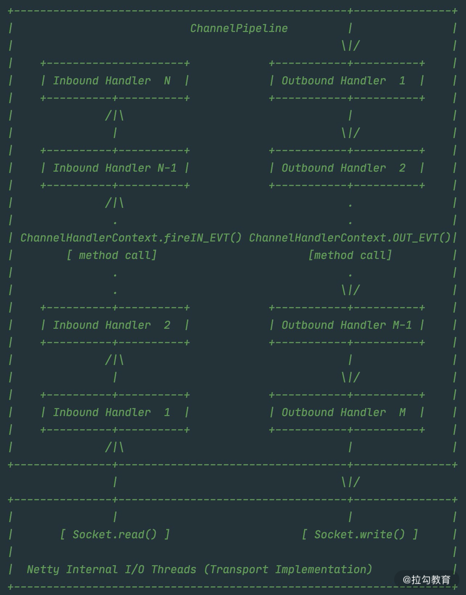
>
> 从上图可以看出，ChannelPipeline 中包含入站 ChannelInboundHandler 和出站 ChannelOutboundHandler 两种处理器，我们结合客户端和服务端的数据收发流程来理解 Netty 的这两个概念。
>
> 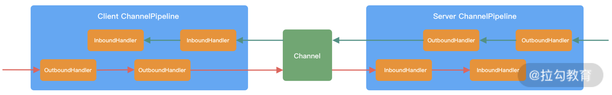
>
> 客户端和服务端都有各自的 ChannelPipeline。以客户端为例，数据从客户端发向服务端，该过程称为出站，反之则称为入站。数据入站会由一系列 InBoundHandler 处理，然后再以相反方向的 OutBoundHandler 处理后完成出站。我们经常使用的编码 Encoder 是出站操作，解码 Decoder 是入站操作。服务端接收到客户端数据后，需要先经过 Decoder 入站处理后，再通过 Encoder 出站通知客户端。所以客户端和服务端一次完整的请求应答过程可以分为三个步骤：客户端出站（请求数据）、服务端入站（解析数据并执行业务逻辑）、服务端出站（响应结果）。
>
> - ChannelHandler & ChannelHandlerContext
>
> 在介绍 ChannelPipeline 的过程中，想必你已经对 ChannelHandler 有了基本的概念，数据的编解码工作以及其他转换工作实际都是通过 ChannelHandler 处理的。站在开发者的角度，最需要关注的就是 ChannelHandler，我们很少会直接操作 Channel，都是通过 ChannelHandler 间接完成。
>
> 下图描述了 Channel 与 ChannelPipeline 的关系，从图中可以看出，每创建一个 Channel 都会绑定一个新的 ChannelPipeline，ChannelPipeline 中每加入一个 ChannelHandler 都会绑定一个 ChannelHandlerContext。由此可见，ChannelPipeline、ChannelHandlerContext、ChannelHandler 三个组件的关系是密切相关的，那么你一定会有疑问，每个 ChannelHandler 绑定ChannelHandlerContext 的作用是什么呢？
>
> 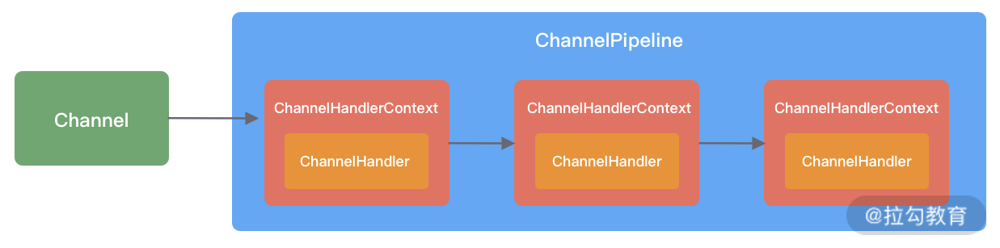
>
> ChannelHandlerContext 用于保存 ChannelHandler 上下文，通过 ChannelHandlerContext 我们可以知道 ChannelPipeline 和 ChannelHandler 的关联关系。ChannelHandlerContext 可以实现 ChannelHandler 之间的交互，ChannelHandlerContext 包含了 ChannelHandler 生命周期的所有事件，如 connect、bind、read、flush、write、close 等。此外，你可以试想这样一个场景，如果每个 ChannelHandler 都有一些通用的逻辑需要实现，没有 ChannelHandlerContext 这层模型抽象，你是不是需要写很多相同的代码呢？
>
> 以上便是 Netty 的逻辑处理架构，可以看出 Netty 的架构分层设计得非常合理，屏蔽了底层 NIO 以及框架层的实现细节，对于业务开发者来说，只需要关注业务逻辑的编排和实现即可。

#### 组件关系梳理
当你了解每个 Netty 核心组件的概念后。你会好奇这些组件之间如何协作？结合客户端和服务端的交互流程，我画了一张图，为你完整地梳理一遍 Netty 内部逻辑的流转。

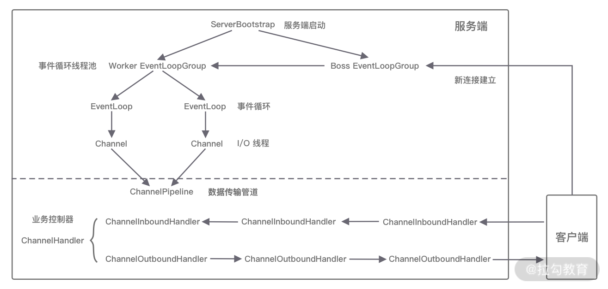

- 服务端启动初始化时有 Boss EventLoopGroup 和 Worker EventLoopGroup 两个组件，其中 Boss 负责监听网络连接事件。当有新的网络连接事件到达时，则将 Channel 注册到 Worker EventLoopGroup。

- Worker EventLoopGroup 会被分配一个 EventLoop 负责处理该 Channel 的读写事件。每个 EventLoop 都是单线程的，通过 Selector 进行事件循环。

- 当客户端发起 I/O 读写事件时，服务端 EventLoop 会进行数据的读取，然后通过 Pipeline 触发各种监听器进行数据的加工处理。

- 客户端数据会被传递到 ChannelPipeline 的第一个 ChannelInboundHandler 中，数据处理完成后，将加工完成的数据传递给下一个 ChannelInboundHandler。

- 当数据写回客户端时，会将处理结果在 ChannelPipeline 的 ChannelOutboundHandler 中传播，最后到达客户端。

#### Netty 源码结构
Netty 源码分为多个模块，模块之间职责划分非常清楚。如同上文整体功能模块一样，Netty 源码模块的划分也是基本契合的。

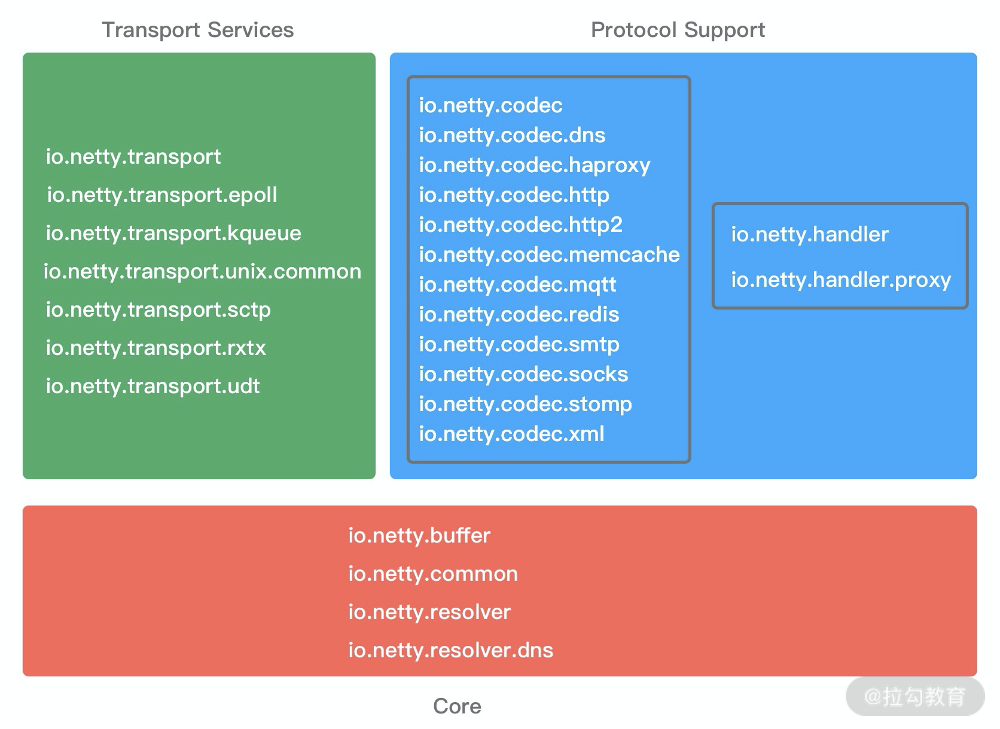

我们不仅可以使用 Netty all-in-one 的 Jar 包，也可以单独使用其中某些工具包。下面我根据 Netty 的分层结构以及实际的业务场景具体介绍 Netty 中常用的工具包。

###### Core 核心层模块
netty-common模块是 Netty 的核心基础包，提供了丰富的工具类，其他模块都需要依赖它。在 common 模块中，常用的包括通用工具类和自定义并发包。

- 通用工具类：比如定时器工具 TimerTask、时间轮 HashedWheelTimer 等。

- 自定义并发包：比如异步模型**Future & Promise**、相比 JDK 增强的 FastThreadLocal 等。

在netty-buffer 模块中Netty自己实现了的一个更加完备的ByteBuf 工具类，用于网络通信中的数据载体。由于人性化的 Buffer API 设计，它已经成为 Java ByteBuffer 的完美替代品。ByteBuf 的动态性设计不仅解决了 ByteBuffer 长度固定造成的内存浪费问题，而且更安全地更改了 Buffer 的容量。此外 Netty 针对 ByteBuf 做了很多优化，例如缓存池化、减少数据拷贝的 CompositeByteBuf 等。

netty-resover模块主要提供了一些有关基础设施的解析工具，包括 IP Address、Hostname、DNS 等。

###### Protocol Support 协议支持层模块
netty-codec模块主要负责编解码工作，通过编解码实现原始字节数据与业务实体对象之间的相互转化。如下图所示，Netty 支持了大多数业界主流协议的编解码器，如 HTTP、HTTP2、Redis、XML 等，为开发者节省了大量的精力。此外该模块提供了抽象的编解码类 ByteToMessageDecoder 和 MessageToByteEncoder，通过继承这两个类我们可以轻松实现自定义的编解码逻辑。

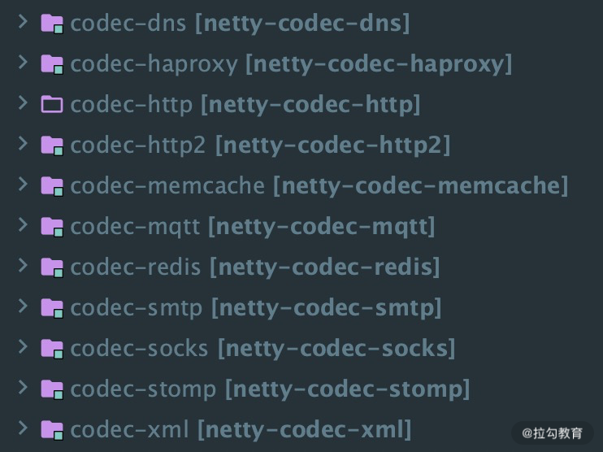

netty-handler模块主要负责数据处理工作。Netty 中关于数据处理的部分，本质上是一串有序 handler 的集合。netty-handler 模块提供了开箱即用的 ChannelHandler 实现类，例如日志、IP 过滤、流量整形等，如果你需要这些功能，仅需在 pipeline 中加入相应的 ChannelHandler 即可。

###### Transport Service 传输服务层模块
netty-transport 模块可以说是 Netty 提供数据处理和传输的核心模块。该模块提供了很多非常重要的接口，如 Bootstrap、Channel、ChannelHandler、EventLoop、EventLoopGroup、ChannelPipeline 等。其中 Bootstrap 负责客户端或服务端的启动工作，包括创建、初始化 Channel 等；EventLoop 负责向注册的 Channel 发起 I/O 读写操作；ChannelPipeline 负责 ChannelHandler 的有序编排，这些组件在介绍 Netty 逻辑架构的时候都有所涉及。

以上只介绍了 Netty 常用的功能模块，还有很多模块就不一一列举了，有兴趣的同学可以在 GitHub（https://github.com/netty/netty）查询 Netty 的源码。

## Netty 组件介绍

### 引导器 -bootStrap

