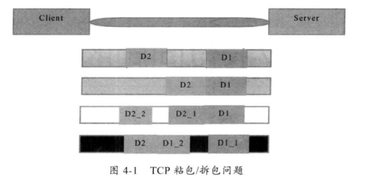
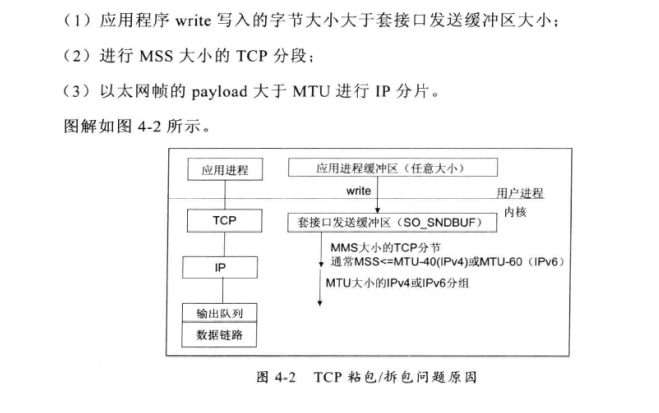

# Netty NIO

#### netty demo

##### 服务端

```java
  public void bind(int port) throws Exception {
        //配置服务端NIO线程组
        EventLoopGroup bossGroup = new NioEventLoopGroup();
        EventLoopGroup workGroup = new NioEventLoopGroup();
        try {
            ServerBootstrap b = new ServerBootstrap();
            b.group(bossGroup, workGroup)
                    .channel(NioServerSocketChannel.class)
                    .option(ChannelOption.SO_BACKLOG, 1024)
                    .childHandler(new ChildChannelHandler());
            //扳道工端口，同步等待成功
            ChannelFuture f = b.bind(port).sync();

            //同步等待服务段监听端口关闭
            f.channel().closeFuture().sync();
        } finally {

            //优雅退出，释放线程池资源
            bossGroup.shutdownGracefully();
            workGroup.shutdownGracefully();
        }
    }


class ChildChannelHandler extends ChannelInitializer<SocketChannel> {
    @Override
    protected void initChannel(SocketChannel socketChannel) throws Exception {
        
        socketChannel.pipeline().addLast(new LineBasedFrameDecoder(1024));
        socketChannel.pipeline().addLast(new StringDecoder());
        socketChannel.pipeline().addLast(new TimeServerHandler());
    }
}
```

> `EventLoopGroup`reactor线程组，boss 用于处理服务端接收客户端连接，work 用于处理socketChannel的网络读写
>
> `ServerBootstrap` Netty用于启动NIO服务端NIO服务端辅助启动类，用于降低开发复杂度，channle()传递建立channel 类型，此处NioServerSocketChannel 相当于 JDK ServerSocketChannel ;option配置TCP参数，此处backlog 设置为1024，最后绑定IO时间的处理类ChildChannelHandler，其作用类似于Reactor模式中的Handler类，主要用于处理网络IO事件，例如 记录日志、对消息惊醒编解码处理等

```java
public class TimeServerHandler extends ChannelHandlerAdapter {

    @Override
    public void channelRead(ChannelHandlerContext ctx, Object msg) throws Exception {
//        super.channelRead(ctx, msg);

        ByteBuf buf = (ByteBuf) msg;
        byte[] req = new byte[buf.readableBytes()];

        buf.readBytes(req);

        String body = new String(req, "UTF-8");

        System.out.println("the  time is receives :" + body);

        String currTime = "QUERY TIME".equalsIgnoreCase(body) ? new Date(System.currentTimeMillis()).toString() : "BAD QUERY";

        ByteBuf resp = Unpooled.copiedBuffer(currTime.getBytes());
        ctx.write(resp);

    }

    @Override
    public void channelReadComplete(ChannelHandlerContext ctx) throws Exception {
//        super.channelReadComplete(ctx);
        ctx.flush();
    }

    @Override
    public void exceptionCaught(ChannelHandlerContext ctx, Throwable cause) throws Exception {
//        super.exceptionCaught(ctx, cause);

        ctx.close();

    }
}

```

> TimeServerHandler 用于对网络IO进行读写操作，通常只需要关注 channelRead 、exceptionCaught 方法
>
> `ByteBuf` 类似于JDK ByteBuffer ，不过它更加强大灵活。readableBytes 可以获取缓冲区可读字节数
> readBytes 可以将缓冲区可读字节数组复制到新建的字节数组中
> ChannelHandlerContext 的write方法用于异步写操作
>
> 当发生异常时关闭 ChannelHandlerContext ，释放和 ChannelHandlerContext 相关联的句柄等资源

##### 客户端

```java
    public void connect(int port, String IPHost) throws Exception {

        //配置客户端NIO线程组
        EventLoopGroup group = new NioEventLoopGroup();

        try {
            Bootstrap b = new Bootstrap();

            b.group(group).channel(NioSocketChannel.class)
                    .option(ChannelOption.TCP_NODELAY, true)
                    .handler(new ChannelInitializer<SocketChannel>() {
                        @Override
                        protected void initChannel(SocketChannel socketChannel) throws Exception {
                            socketChannel.pipeline().addLast(new LineBasedFrameDecoder(1024));
                            socketChannel.pipeline().addLast(new StringDecoder());
                            socketChannel.pipeline().addLast(new TimeClientHandler());
                        }
                    });

            //发起异步连接操作
            ChannelFuture f = b.connect(IPHost, port).sync();

            //等待客户端链路关闭
            f.channel().closeFuture().sync();
        } finally {

            group.shutdownGracefully();
        }

    }


public class TimeClientHandler extends ChannelHandlerAdapter {

    private final ByteBuf firstMsg;


    public TimeClientHandler() {
        byte[] bytes = "QUERY TIME".getBytes();
        firstMsg = Unpooled.buffer(bytes.length);
        firstMsg.writeBytes(bytes);
    }

    @Override
    public void channelActive(ChannelHandlerContext ctx) throws Exception {
        ctx.writeAndFlush(firstMsg);
    }

    @Override
    public void channelRead(ChannelHandlerContext ctx, Object msg) throws Exception {
        ByteBuf buf = (ByteBuf) msg;
        byte[] req = new byte[buf.readableBytes()];

        buf.readBytes(req);

        String body = new String(req, "UTF-8");

        System.out.println("the  time is receives(body) :" + body);
    }

    @Override
    public void exceptionCaught(ChannelHandlerContext ctx, Throwable cause) throws Exception {
//        super.exceptionCaught(ctx, cause);

        System.out.println("client shut down by close" + cause.getMessage());
        ctx.close();

    }
}
```

> 当客户端和服务端建立链路成功之后，netty 的NIO 线程会调用 channelActive 方法，通过ctx.write 发送指令给服务端

##### 总结

经过简单demo 使用，发现相比于传统NIO，netty 代码更加简洁、开发难度更低、扩展性更好，非常适合作为基础通信框架被用户集成使用

#### TCP粘包/拆包问题

> `TCP 编程` 无论服务端/客户端，当我们读取/发送消息的时候，都要考虑TCP底层的粘包/拆包机制

##### TCP 粘包/拆包 是什么？

> TCP 是个"流" 协议，所谓流，就是没有界限的一串数据。
>
> TCP底层并不了解上层业务数据的具体含义，它会根据TCP缓冲区的实际情况进行包打划分，所以在业务上认为，一个完整的包可能会被TCP拆分成多个包进行发送，也有可能把多个小弟包封装成一个大的数据包发送，这就是所谓的TCP粘包/拆包问题



###### 粘包/拆包 说明

假设客户端分别发送两个数据包D1 、D2发送给服务端，由于服务端一次读取到的字节数是不确定的，故可能存在以下四种情况

- 服务端分来个那次读取到了两个独立的数据包，分别是D1\D2,没有发生粘包/拆包
- 服务端一次接收到两个数据包，D1和D2粘在一起，别称为粘包
- 服务端分两次读取到两个数据包，D1完整内容和D2的部分内容，第二次读取到D2的剩余内容  这别称为拆包
- 服务端分两次读取到两个数据包，第一次读取到D1的部分内容，第二次 D1剩余内容和D2的完整内容
- 如果服务TCP接收滑窗非常小，而数据包D1、D2 比较大，则会发生第五种情况，服务端多次拆包读取才能将 D1、D2  数据完整读取出来

###### 原因



###### 粘包-解决策略

> TCP底层无法理解上层业务数据，所以在底层是无法保证数据不被拆分和重组的，这个问题之恶能通过上层的应用协议栈设计来解决

- 消息定长 eg: 每个报文的大小固定为200子节，如果不够，空位补空格
- 在包尾增加回车换行符进行分割，例如 FTP协议
- 将消息分为消息头和消息体，雄安洗头中包含表示消息总长度（或者消息体长度）的字段，通常设计思路为消息头的第一个字段使用int32来表示消息的总长度
- 复杂的应用层协议

##### 不解决TCP 粘包导致功能异常案例

> 更改timeserver 后执行命令，发现server端 count统计数据发生次数少于100 发生粘包现象
>
> 由于服务端接收到的包少于100 所以客户端接收到的应答包也少于100条，此处与设计不符
>
> 由于使用netty nio时没有考虑TCP 粘包/拆包现象，所以当程序代码发生粘包/拆包时，代码逻辑就会发生问题

##### Netty 解决TCP 粘包/拆包方案

> 为了解决TCP 粘包/拆包导致的半包读写问题，netty默认提供了多种编解码器用于处理半包
>
> eg：`LineBasedFrameDecoder`、`StringDecoder`

###### `LineBasedFrameDecoder`、`StringDecoder`原理分析

- LineBasedFreameDecoder 一次遍历ByteBuf中的刻度字节直到遇到 "\n" 或者 "\r\n",以换行符为结束符（结束位置），从可读索引到结束位置区间的字节就组成一行数据。他是以换行符为结束标志的解码器，支持写道结束符或者不携带结束符两种解码方式，同时支持配置单行最大长度。如果连续读取到最大长度后仍然没有发现换行符，就会抛出异常，同时忽略掉之前读到的异常码流
- StringDecoder 功能简单，就是将接收到的对象转换成字符串，然后继续调用后面的handler。
- LineBasedFreameDecoder +StringDecoder 组合就是按行切换的文本解码器，它被设计用来支持TCP的粘包和拆包

##### 分隔符和定长解码器

> TCP以流的方式进行数据传输，上层应用协议为了对消息进行区分，一般会采用如下4种方式

- 消息长度固定，累计读取到长度综合为定长LEN的报文后，就认为读取到了一个完整的消息；将计数器置位，重新开始读取下一个数据报
- 将回车换行符作为消息结束符，例如 FTP协议，这种方式在文本西医中应用比较广泛
- 将特殊的分隔符作为消息的结束标志，回车换行符就是一种特殊的结束分隔符
- 通过在消息头中定义长度字段来标识消息的总长度

> netty 对上述四种解码应用做了统一抽象
>
> eg：`DelimiterBasedFrameDecoder` 可以自动完成以分隔符做结束标志的信息的解码
>
> `FixedLengthFrameDecoder` 可以完成定长消息的解码

