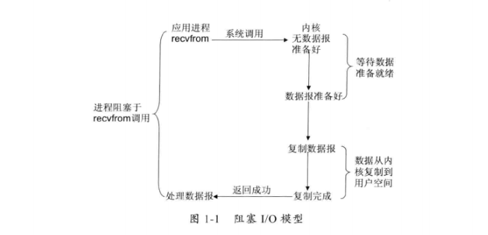
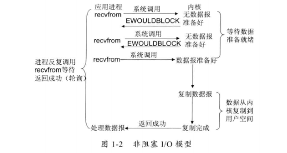
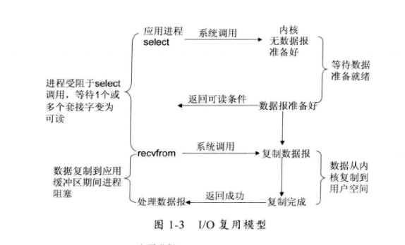
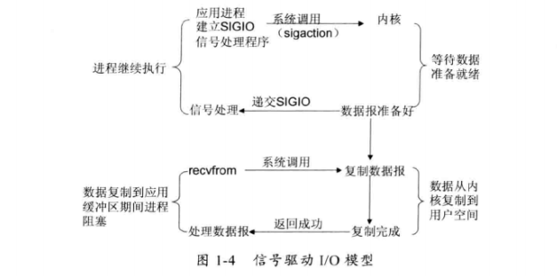
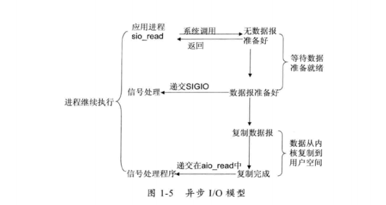
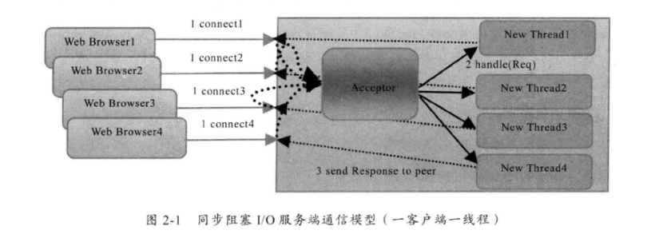
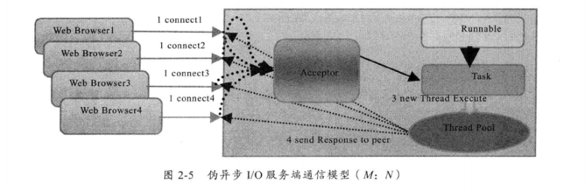

## Netty-基础

###### 异步非阻塞

- [ ] 异步高性能内部协议栈
- [ ] 异步HTTP
- [ ] 异步SOAP
- [ ] 异步SMPP
- [ ] Reactor模型

###### Java-NIO 缺点（JSR51-JDK1.4提供NIO 没有流行起来）

- 大多数高性能服务器，被C和C++语言盘踞，由于它们可以直接使用操作系统的异步I/O能力，所以对JDK的NIO并不关心。
- 移动户量网尚未兴起，基于Java的大规模分布式系统极少，很多中小型应用服务对于异步I/O的诉求不是很强烈。
- 高性能、高可靠性领域，列如银行、证券、电信等，依然以C++为主导，Java充当打杂的角色，NIO暂时没有用武之地。
- 当时主流的J2EE服务器，几乎全部基于同步阻塞I/O构建，列如Servelet、Tomcat等，由于它们应用广泛，如果这些容器不支持NIO，用户很难具备独立构建异步协议栈的能力。
- 异步NIO编程门槛比较高，开发和维护一款基于NIO的协议栈对很多中小型公司来说是一场噩梦。
- 业界NIO框架不成熟，很难商用
- 国内研发界对NIO的陌生和认知不足，没有充分重视

### [基础篇]-Java NIO

#### I/O基础入门

##### JavaIO早期问题

- 没有数据缓冲区，I/O性能存在问题
- 没有C或者C++中的Channel概念，只有输入和输出流
- 同步阻塞式IO通信（BIO），通常会导致通信线程被长时间阻塞
- 支持的字符集有限，硬件可移植性不好

##### Linux网络I/O模型

- 阻塞IO模型

  > 这是最常用的简单的IO模型。阻塞IO意味着当我们发起一次IO操作后一直等待成功或失败之后才返回，在这期间程序不能做其它的事情。阻塞IO操作只能对单个文件描述符进行操作，详见[read](https://link.zhihu.com/?target=http%3A//man7.org/linux/man-pages/man2/read.2.html)或[write](https://link.zhihu.com/?target=http%3A//man7.org/linux/man-pages/man2/write.2.html)。

  

- 非阻塞IO模型

  > 每次客户询问内核是否有数据准备好，即文件描述符缓冲区是否就绪。当有数据报准备好时，就进行拷贝数据报的操作。当没有数据报准备好时，也不阻塞程序，内核直接返回未准备就绪的信号，等待用户程序的下一个轮寻。

  

- **IO复用模型(同步非阻塞(NIO))**

  > 一句话解释：单线程或单进程同时监测若干个文件描述符是否可以执行IO操作的能力。
  > **IO多路转接是多了一个select函数，select函数有一个参数是文件描述符集合，对这些文件描述符进行循环监听，当某个文件描述符就绪时，就对这个文件描述符进行处理。**

  

- 信号驱动IO模型

  > 信号驱动IO模型，应用进程告诉内核：当数据报准备好的时候，给我发送一个信号，对SIGIO信号进行捕捉，并且调用我的信号处理函数来获取数据报。

  

- 异步IO模型(异步非阻塞(AIO))

  > 当应用程序调用aio_read时，内核一方面去取数据报内容返回，另一方面将程序控制权还给应用进程，应用进程继续处理其他事情，是一种非阻塞的状态。

  

- IO
- 异步
- 同步
- 阻塞
- 非阻塞

##### IO多路复用

###### 使用场景

- 服务器需要同时处理多个处于监听状态或者多个连接状态的套接字
- 服务器需要同时处理多种网络协议的套接字

###### 支持IO复用的系统调用

- select

  > select 最大缺陷就是单进程所打开的FD是由一定限制的，由FD_SETSIZE设置，默认值1024.
  >
  > epoll做了改进，支持FD上限是操作系统最大文件句柄

- pselect

- poll

- epoll

> 1.支持一个进程打开的socket描述符（FD） 不受限制（仅受限于操作系统最大文件句柄）
>
> 2.IO效率不会随着FD数目的增加而线性下降（select/epoll线性扫描socket集合，导致效率下降，epoll 据每个fd上面的callback函数实现，只有活跃的socket才会主动调用callback函数）
>
> 3.使用mmap加速内核与用户空间的消息传递（**零拷贝** 内核空间->用户空间的数据拷贝可以使用内存空间映射，让用户空间、内核空间使用同一块内存实现，从而避免不必要的数据拷贝消耗）
>
> 4.epoll的API更加简单

##### Java-IO演进

- Java1.0-1.3 IO模型为阻塞IO，提供API非常原始，很多网络编程相关概念、接口等都没有在IO类库中得以提现，eg：Pipe、Channel、Selector等
- Java1.4（JSR-51）新增java.io包，提供很多异步IO开发的API和类库
  - 异步IO操作的缓冲区ByteBuffer
  - 异步IO操作的管道Pipe
  - 操作IO的通道Channel，如ServerSocketChannel和SocketChannel
  - 多种字符集的编码能力和解码能力
  - 实现非阻塞IO操作的多路复用器selecttor
  - 基于流行的Perl实现的正则表达式类库
  - 文件通道FilChannel*
- 不完善的地方
  - 没有统一的文件属性
  - API能力较弱，eg：目录的级联创建和递归遍历，往往需要自己实现
  - 底层存储系统的一些高级API无法使用
  - 所有文件操作都是同步阻塞调用，不支持异步文件读写操作

- Java1.7 （NIO2.0 JSR203）改进
  - 批量获取文件属性API，且平台无关性，不予特定的文件系统耦合。扩展提供标准文件系统SPI，共各服务商扩展实现
  - 提供AIO功能，支持基于文件的异步IO操作和针网络套接字的异步操作
  - 完成JSR-51定义的通道功能，包括对配置和多播数据报的支持

##### 传统BIO模型

- server（负责绑定IP ，同时监听端口）eg：serverSocket

- client （负责向server发起连接请求，成功后通过IO流进行同步阻塞式通信）eg: socket

  > 网络编程的基本模型：client/Server 模型，也就是两个进程之间进行相互通信

###### BIO通信模型图

> **原理**：通过一个独立的Acceptor线程负责监听客户端的连接，他接收到客户端连接请求后为每个客户端创建一个独立的线程进行链路处理，处理完成之后，通过输出流返回应答给客户端，线程销毁
>
> **缺点**：缺乏弹性伸缩能力，当客户端并发访问量增加啊之后，服务端的线程个数和客户端并发访问数呈1：1的正比关系，由于线程资源是操作系统中十分宝贵的资源，当线程数量膨胀后，会导致系统线程堆栈溢出、创建新线程失败等问题，并最终导致服务进程宕机、僵死，不能对外提供服务
>
> **改进**：1：1连接模型，线程池/消息队列m:n (m各线程，处理n个客户端的模型，其中n远大于m)，但由于其底层任然使用BIO模型，所以被称为伪异步

##### 伪异步IO编程

> M:N模型（线程池），来处理多个客户端接入请求，灵活调配线程资源

###### 伪异步IO模型图

> **原理**：当有新的客户端接入是，将客户端的socket封装成一个task（该任务实现java.lang.Runnable接口）投递到后端的线程池中进行处理，由于线程池可以设置任务队列的大小和最大线程数，因此，他的资源占用是可控的，无论多少个客户端并发访问都不会导致资源的耗尽和宕机
>
> **缺点**：底层使用任是BIO ，没有从根本上解决问题
> **BIO弊端**: 
> ***READ***当对socket的输入流进行读取操作时，它会一直阻塞下去，直到发生如下三种事件
> 1 有数据可读
> 2 可用数据已经读取完毕
> 3 发生空指针/IO等异常
> 这意味着，当线程池中没有空闲线程，而线程阻塞在长等待的任务中，新的任务只能入队等待得不到执行的机会
> ***WRITE***消息发送方一直阻塞，不能再向TCP缓冲区写入信息，知道TCP消息接收方处理完数据信息/发生IO异常
>
> 读写操作都是基于同步阻塞IO的，阻塞的时间取决于对方IO线程处理速度和网络IO的传输速度，服务解耦，不能依赖于良莠不齐的第三方系统
> 伪异步实际上仅是对之前BIO模型的一个简单优化，无法从根本上解决同步IO导致的通信线程阻塞问题

###### 通信第三方返回应答时间过长引起的级联故障

- 服务端处理缓慢，返回应答消息耗费60s，平时只需要10ms
- 采用伪异步IO的线程正在读取故障服务节点的响应，由于读取输入流是阻塞的，他将会同步阻塞60s
- 假如所有可用线程资源都被故障服务器阻塞，那后续所有的IO消息都将在队列中排队
- 由于线程池采用阻塞队列实现，当阻塞队列积满后，后续入队的操作将被阻塞
- 由于前端只有一个Accptor线程接收客户端接入，它被阻塞在线程池的同步阻塞队列后，新的客户端请求消息将被拒绝，客户端会发生大量的连接超时
- 由于几乎所有的连接都超时，调用者会认为系统已经崩毁，无法接收新的请求消息

##### NIO编程（NEW IO/Non-block IO (新IO/非阻塞IO)）

- SocketChannel（socket）

- ServerSocketChannel(ServerSocket)

  > 提供两种不同的套接字实现
  >
  > 新增套接字支持阻塞/非阻塞 两种模式

- 模式应用场景

  - 阻塞：低负载、低并发
  - 非阻塞：高负载、高并发的网络应用

###### NIO类库简介

- 缓冲区Buffer

  > 包含一些要写入或者读出的数据，NIO的所有数据处理都是用缓冲区进行处理的 读/写操作于缓冲区
  > 缓冲区实质上是一个数组，但又不仅仅是一个数组，他还包含一组用于对数据结构化访问以及维护读写位置（limit）等信息
  > 常用缓冲区ByteBuffer 其他（除了Boolean）：CharBuffer、ShortBuffer、IntBuffer、LongBuffer、FloatBuffer、DoubleBuffer
  > 因为大多数标准IO操作都是用ByteBuffer，所以它在具有一般缓冲区

