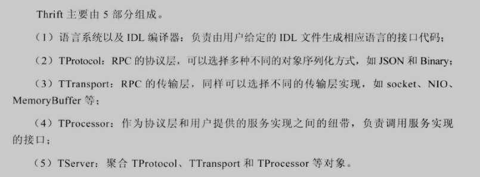
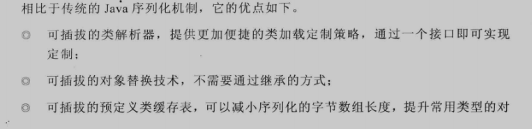
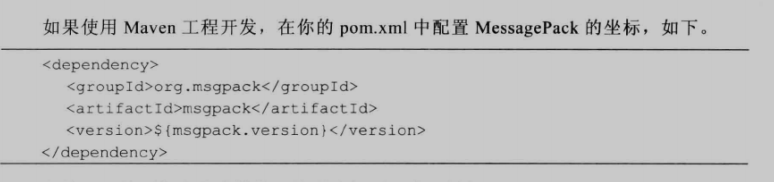
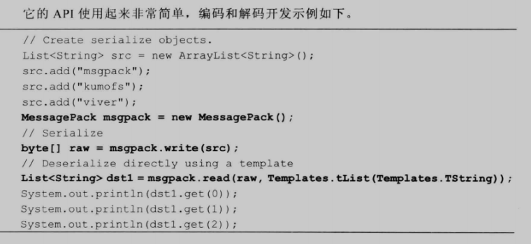
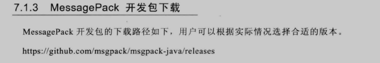
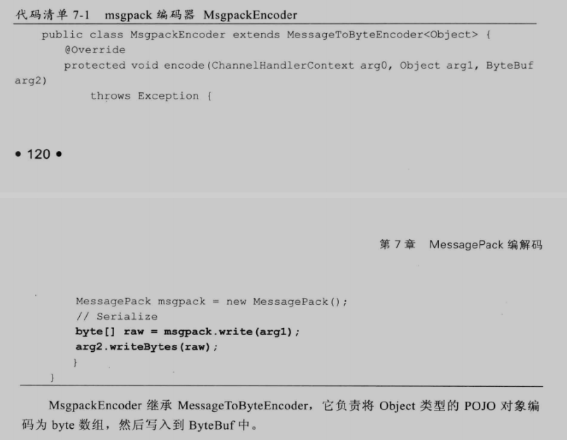
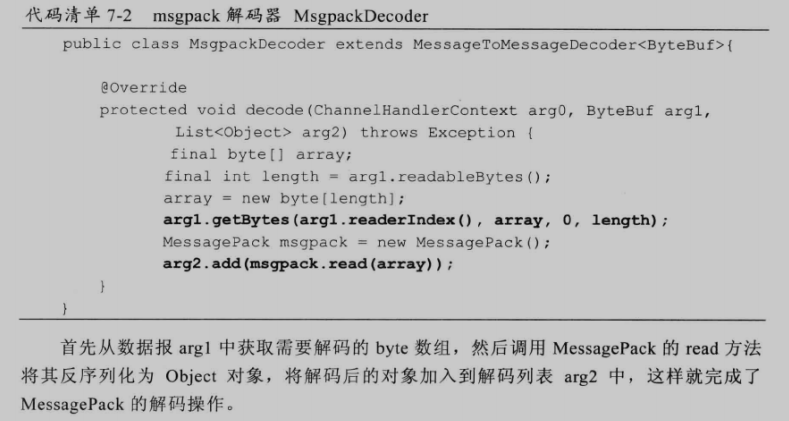

# Netty -中级篇-编解码技术

### 编解码技术

> Java序列化技术主要目的：（objectInputStream/objectOutputStream）用于将Java对象作为可存储的字节数组写入文件，也可以传输到网络上。基于JDK默认的序列化机制可以避免操作底层的字节数组，从而提升开发效率
>
> - **网络传输**
> - 对象持久化
>
> Netty的NIO基于网络开发，重点关注网络传输。当跨进程服务调用时，需要把被传输的Java对象编码为字节数组或者ByteBuffer对象，而当远程服务读取到ByteBuffer对象或者字节数组时，需要将其解码为发送时的Java对象
>
> 由于Java序列化仅是Java编解码技术的一种，且由于它的种种缺陷，衍生出多种编解码技术和框架

#### 评判一个编解码框架优略

- 是否支持跨语言
- 编码后码流大小
- 编解码的性能
- 类库是否小巧，API是否方便使用
- 使用者需要手工开发的工作量和难度

#### Java序列化的缺点

> Java序列化从JDK1.1 提供，只需要实现java.io.Serializable 并生成ID即可，而不需要引入其他类库
>
> 但是在远程服务调用（RPC）时，很少直接使用Java序列化进行消息的编解码和传输

- 无法跨语言

  Java序列化是Java私有协议，其他语言无法进行反序列化操作，对于跨进程服务调用来说，各进程不一定是用Java语言进行开发的

- Java序列化后码流占用空间太大

  在同等情况下，编码后字节数组越大，存储的时候越占空间，存储的硬件成本就越高，并且在网络传输是更占带宽，导致系统的吞吐量降低

- 序列化性能太低

#### 业界主流编解码框架

##### Google protobuf

> protobuf 全称 Google Protocol Buffers ，由谷歌开源而来
>
> 数据结构以 .proto文件进行描述，通过代码生成工具可以生成对应数据结构的POJO对象和Protobuf相关的方法和属性
>
> 特点：
>
> - 结构化数据存储格式（xml，json等）
> - 高效的编解码性能
> - 语言无关、平台无关、扩展性好
> - 官方支持Java、C++、python 三种语言
>
> 不适用xml 的理由，尽管xml可读性、可扩展性非常好，也非常适合描述数据结构，但是xml解析时间开销和xml为了可读性而牺牲的空间开销都非常达，因此不适合做高性能通信协议
>
> protobuf 使用二进制编码，在空间、性能上具有更大优势。还有它的数据描述文件和代码生成机制，利用文件对数据结构进行说明的优点如下
>
> - 文本化的数据结构描述语言，可以实现语言和平台无关，特别适合异构系统间的集成
> - 通过标识字段的顺序，可以实现协议的前向兼容
> - 自动代码生成，不需要手工编写同样数据结构的C++和Java版本
> - 方便后续的管理和维护 相比于代码，结构化的文档更容易维护和管理
>
> protobuf 的编解码性能远远高于其他几种序列化框架的序列化和反序列化，这也是很多RPC框架选用protobuf 做编解码框架的原因

##### Facebook thrift

> Thrift 源于Facebook，创造Thrift是为了解决Facebook 各系统间大数据量的传输通信及系统之间语言环境不同需要跨平台的特性 ，因此thrift可以支持多种程序语言 eg：c++、C#、cocoa、erlang、Haskell、Java、ocami、perl、PHP、python、ruby、和smalltalk
>
> 在多种不同语言之间通信，可作为高性能通信中间件使用，支持数据（对象）序列化和多种类型的RPC服务 。适用于静态数据交换，需要先确定好他的数据结构，当数据结构发生变化时，必须重新编辑IDL文件生成代码和编译

##### Jboss Marshalling 

> 是一个Java对象的序列化API包，修正了JDK自带的序列化包的很多维妮塔，但又保持于Serializeable接口的兼容。同时增加了一些可调的参数和附加特性，其中参数、特性可以通过工厂类进行配置

Jboss Marshalling  更多是在jboss内部使用，应用范围有限

#### MessagePack 编解码

> MessagePack  是一个高效的二进制序列化框架，它像json一样支持不同语言间的数据交换，但它的性能更快，序列化后的码流也更小
>
> 特性：
>
> - 编解码高效、性能高
> - 序列化后的码流更小
> - 支持跨语言

##### MessagePack  Java API 

##### MessagePack  编解码器开发

> netty 的编解码器框架可以非常方便地集成第三方序列化框架，netty预集成了几种，用户也可自定义或根据需求集成其他编解码器框架
>
> 

