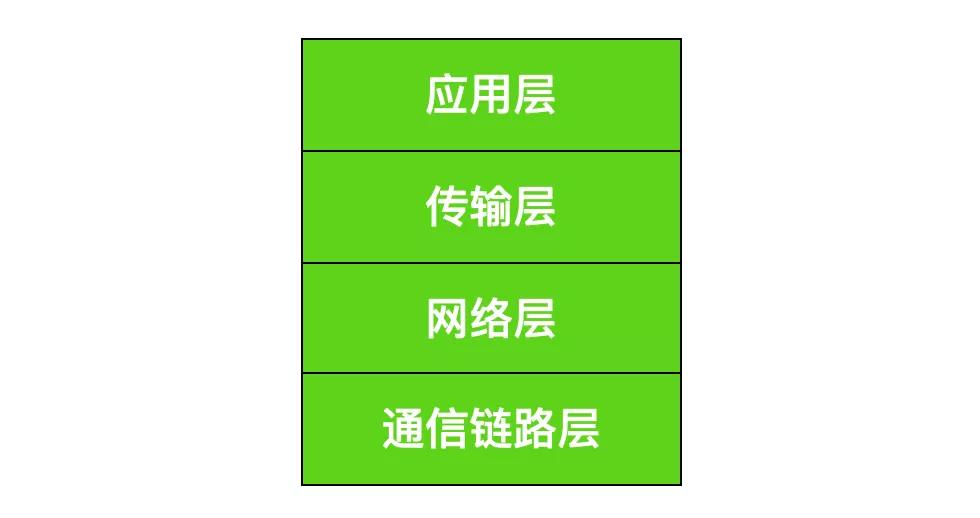
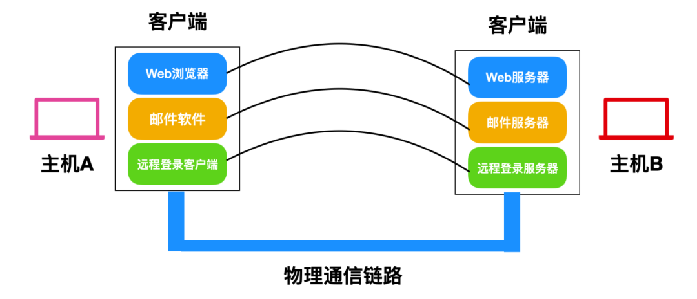
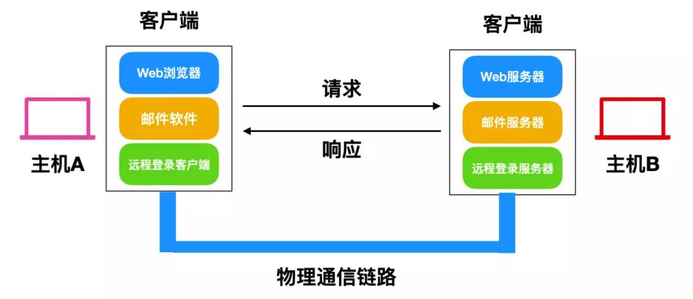
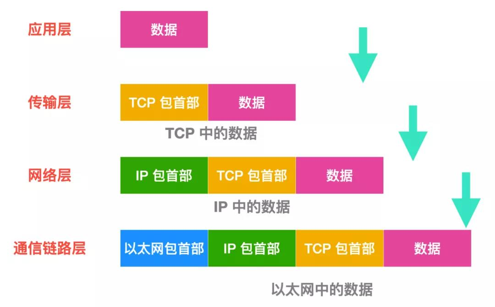
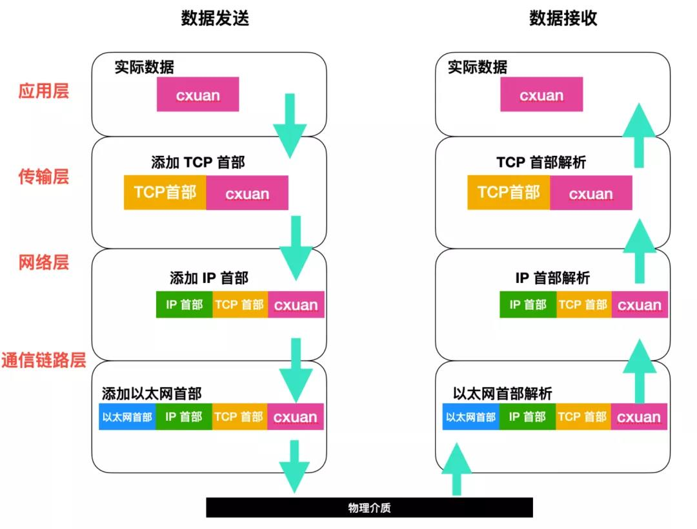
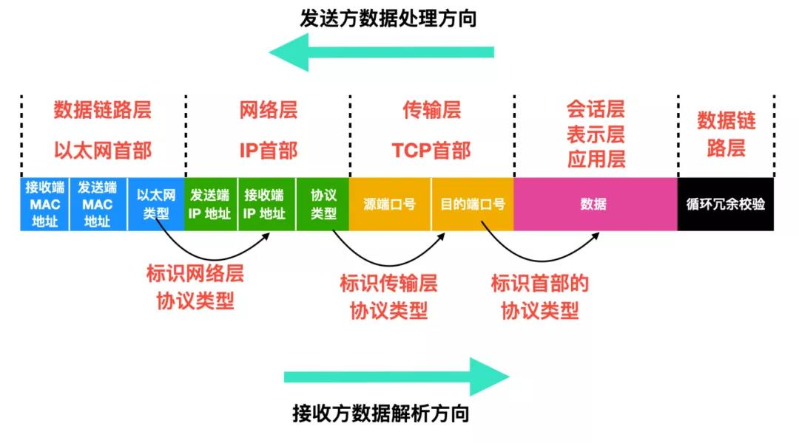

## TCP/IP 基础知识总结

### TCP/IP 历史背景

最初还没有 TCP/IP 协议的时候，也就是在 20 世纪 60 年代，许多国家和地区认识到通信技术的重要性。美国国防部希望能够研究一种即使通信线路被破坏也能够通过其他路线进行通信的技术。为了实现这种技术，出现了`分组`网络。

即使在两个节点通信的过程中，几个节点遭到破坏，却依然能够通过改变线路等方式使两个节点之间进行通信。

这种分组网络促进了 `ARPANET(Advanced Research Projects Agency Network)` 的诞生。ARPANET 是第一个具有分布式控制的广域包分组交换网络，也是最早实现 TCP/IP 协议的前身。

> ARPANET 其实是由 美国国防部高级研究计划局 计划建立。

这里我们先来认识一下 TCP/IP 协议，TCP/IP 协议说的不仅仅只是 TCP 和 IP 这两种协议，实际上，TCP/IP 指的是协议簇，协议簇是啥呢？简单来说就是一系列协议的综合，如果下次再问你 TCP/IP 协议有哪些的话，可以把下面这张图甩给他

### TCP/IP 标准

TCP/IP 相较于其他协议的标准，更注重两点：`开放性` 和 `实用性`，即标准化能否被实际使用。

开放性说的是 TCP/IP 是由 `IETF` 讨论制定的，而 IETF 本身就是一个允许任何人加入进行讨论的组织。

实用性说的是就拿框架来说，如果只浮于理论，而没有落地的实践，那么永远成为不了主流。

TCP/IP 的标准协议就是我们所熟知的 `RFC 文档`，当然你可以在网络上看到。RFC 不仅规范了协议标准，还包含了协议的实现和使用信息。

关于更多 RFC 协议，你可以看一下官方文档 https://www.rfc-editor.org/rfc-index.html

这里我们不再详细展开介绍了，我们这篇文章的重点要放在对 TCP/IP 的研究上。

## TCP/IP 协议簇

下面我们就开始聊一聊 TCP/IP 协议簇。

TCP/IP 协议是我们程序员接触最多的协议，OSI 模型共有七层，从下到上分别是物理层、数据链路层、网络层、运输层、会话层、表示层和应用层。但是这显然是有些复杂的，所以在 TCP/IP 协议中，它们被简化为了四个层次

#### 通信链路层

如果非要细分的话，通信链路层也可以分为 `物理层` 和 `数据链路层`。

#### 物理层

物理层是 TCP/IP 的最底层是负责传输的硬件，这种硬件就相当于是以太网或电话线路等物理层的设备。

#### 数据链路层

另外一层是数据链路层，数据链路层位于物理层和网络层中间，数据链路层定义了在单个链路上如何传输数据。

#### 网络层

网络层主要使用 `IP`协议，IP 协议基于 IP 地址转发分包数据。

IP 协议的主要作用就是将分组数据包发送到目标主机

TCP/IP 分层中的互联网层与传输层的功能通常由操作系统提供。

IP 还隐含着数据链路层的功能，通过 IP 协议，相互通信的主机之间不论经过怎样的底层数据链路，都能够实现相互通信。

虽然 IP 也是一种分组交换协议，但是 IP 却不具备重发机制。即使数据没有到达另一端也不会进行重发，所以 IP 属于非可靠性协议。

网络层还有一种协议就是 `ICMP`，因为 IP 在数据包的发送过程中可能会出现异常，当 IP 数据包因为异常而无法到达目标地址时，需要给发送端发送一个异常通知，ICMP 的主要功能就在于此了。鉴于此情况，ICMP 也可以被用来诊断网络情况。

### 传输层

我们上面刚介绍完 TCP/IP 协议最重要的 IP 协议后，下面我们来介绍一下传输层协议，TCP 协议是传输层协议的一种。

传输层就好像高速公路一样，连接两个城市的道路。下面是互联网的逻辑通道，你可以把它想象成为高速公路。

传输层最主要的功能就是让应用层的应用程序之间完成通信和数据交换。在计算机内部运行着很多应用程序，每个应用程序都对应一个端口号，我们一般使用端口号来区分这些应用程序。

传输层的协议主要分为面向有连接的协议 TCP 和面向无连接的协议 UDP

- **TCP**

  TCP 是一种可靠的协议，它能够保证数据包的可靠性交付，TCP 能够正确处理传输过程中的丢包、传输顺序错乱等异常情况。此外，TCP 还提供拥塞控制用于缓解网络拥堵。

- **UDP**

  UDP 是一种不可靠的协议，它无法保证数据的可靠交付，相比 TCP ，UDP 不会检查数据包是否到达、网络是否阻塞等情况，但是 UDP 的效率比较高。

  UDP 常用于分组数据较少或者广播、多播等视频通信和多媒体领域。

#### 应用层

在 TCP/IP 协议簇中，将 OSI 标准模型中的会话层、表示层都归为了应用层。应用层的架构大多属于客户端/服务端模型，提供服务的程序叫做服务端、接受服务的程序叫做客户端。在这种架构中，服务端通常会提前部署到服务器上，等待客户端的连接，从而提供服务。

## 数据包的发送历程

### 数据包结构

我们首先先来认识一下数据包的结构，这里 cxuan 只是给你简单介绍一下，后面的文章会更加详细的介绍。

在上面的每个分层中，都会对所发送的数据增加一个 `首部`，这个首部中包含了该层必要的信息。每一层都会对数据进行处理并在数据包中附上这一层的必要信息。下面我们就来聊一聊数据包的发送过程。

### 数据包发送历程

假设主机 A 和主机 B 进行通信，主机 A 想要向主机 B 发送一个数据包，都会经历哪些奇特的操作？

**应用层的处理**

主机 A 也就是用户点击了某个应用或者打开了一个聊天窗口输入了`cxuan`，然后点击了发送，那么这个 cxuan 就作为一个数据包遨游在了网络中，等下还没完呢，应用层还需要对这个数据包进行处理，包括字符编码、格式化等等，这一层其实是 OSI 中表现层做的工作，只不过在 TCP/IP 协议中都归为了应用层。

数据包在发送的那一刻建立 TCP 连接，这个连接相当于通道，在这之后其他数据包也会使用通道传输数据。

**传输层的处理**

为了描述信息能准确的到达另一方，我们使用 TCP 协议来进行描述。TCP 会根据应用的指示，负责建立连接、发送数据和断开连接。

TCP 会在应用数据层的前端附加一个 TCP 首部字段，TCP 首部包含了`源端口号` 和 `目的端口号`，这两个端口号用于表明数据包是从哪里发出的，需要发送到哪个应用程序上；TCP 首部还包含`序号`，用以表示该包中数据是发送端整个数据中第几个字节的序列号；TCP 首部还包含 `校验和`，用于判断数据是否损坏，随后将 TCP 头部附加在数据包的首部发送给 IP。

**网络层的处理**

网络层主要负责处理数据包的是 IP 协议，IP 协议将 TCP 传过来的 TCP 首部和数据结合当作自己的数据，并在 TCP 首部的前端加上自己的 IP 首部。因此，IP 数据包后面会紧跟着 TCP 数据包，后面才是数据本身。IP 首部包含目的和源地址，紧随在 IP 首部的还有用来判断后面是 TCP 还是 UDP 的信息。

IP 包生成后，会由路由控制表判断应该发送至哪个主机，IP 修饰后的数据包继续向下发送给路由器或者网络接口的驱动程序，从而实现真正的数据传输。

> 如果不知道目标主机的 MAC 地址，可以利用 `ARP(Address Resolution Protocol)` 地址解析协议进行查找。

**通信链路层的处理**

经由 IP 传过来的数据包，以太网会给数据附上以太网首部并进行发送处理。以太网首部包含接收端的 MAC 地址、发送端的 MAC 地址以及标志以太网类型的以太网数据协议等。

下面是完整的处理过程和解析过程。

如上图所示，左侧是数据的发送处理过程，应用层的数据经过层层处理后会变为可以发送的数据包，经过物理介质发送至指定主机中。

数据包的接收流程是发送流程的逆序过程，数据包的解析同样也会经过下面这几步。

**通信链路的解析**

目标主机收到数据包后，首先会从以太网的首部找到 MAC 地址判断是否是发给自己的数据包，如果不是发给自己的数据包则会丢弃该数据包。

如果收到的数据包是发送给自己的，就会查找以太网类型判断是哪种协议，如果是 IP 协议就会扔给 IP 协议进行处理，如果是 `ARP` 协议就会扔给 ARP 协议进行处理。如果协议类型是一种无法识别的协议，就会将该数据包直接丢弃。

**网络层的解析**

经过以太网处理后的数据包扔给网络层进行处理，我们假设协议类型是 IP 协议，那么，在 IP 收到数据包后就会解析 IP 首部，判断 IP 首部中的 IP 地址是否和自己的 IP 地址匹配，如果匹配则接收数据并判断上一层协议是 TCP 还是 UDP；如果不匹配则直接丢弃。

> 注意：在路由转发的过程中，有的时候 IP 地址并不是自己的，这个时候需要借助路由表协助处理。

**传输层的处理**

在传输层中，我们默认使用 TCP 协议，在 TCP 处理过程中，首先会计算一下 `校验和`，判断数据是否被损坏。然后检查是否按照序号接收数据，最后检查端口号，确定具体是哪个应用程序。

数据被完整的识别后，会传递给由端口号识别的应用程序进行处理。

**应用程序的处理**

接收端指定的应用程序会处理发送方传递过来的数据，通过解码等操作识别出数据的内容，然后把对应的数据存储在磁盘上，返回一个保存成功的消息给发送方，如果保存失败，则返回错误消息。

上面是一个完整的数据包收发过程，在上面的数据收发过程中，涉及到不同层之间的地址、端口号、协议类型等，那么我们现在就来剖析一下。

数据包经过每层后，该层协议都会在数据包附上包首部，一个完整的包首部图如下所示

在数据包的发送过程中，各层依次对数据包添加了首部信息，每个首部都包含发送端和接收端地址以及上一层的协议类型。以太网会使用 MAC 地址、IP 会使用 IP 地址、TCP/UDP 则会用端口号作为识别两端主机的程序进程。

此外，每个分层中的包首部还包含一个识别位，它是用来标识上一层协议的种类信息。