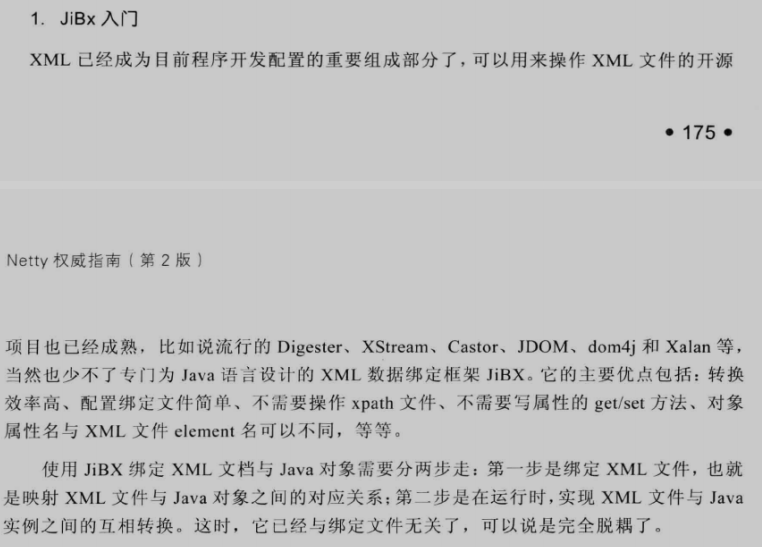

# Netty-[高级篇] 多协议开发和应用

### HTTP 协议开发应用

> http (超文本传输协议) 协议是建立在TCP传输协议之上的应用层协议
> http协议是一个属于应用层的面向对象的协议，由于其简捷、快速的方式，适用于分布式超媒体信息系统
>
> 由于netty 的http协议栈是基于netty的NIO通信框架开发的，因此，netty的http协议也是异步非阻塞的

#### HTTP 协议介绍

> http协议是一个属于应用层的面向对象的协议，由于其简捷、快速的方式，适用于分布式超媒体信息系统
>
> 特点:
>
> - 支持client/server模式
> - 简单-客户端向服务器请求服务时，只需要指定服务URL，携带必要的请求参数或者消息体
> - 灵活-HTTP允许传输任意类型的数据对象，传输的内容类型由HTTP 消息头中的Content-Type加以标记
> - 无状态-HTTP协议是无状态协议，无状态是指协议对于事务处理没有记忆能力。缺少状态一位置如果后续处理需要之前的信息，则他必须重传，这样可能导致每次连接传送的数据量增大。另一方面，在服务器不需要先前信息时它的应答就较快，负载较轻

##### HTTP协议的URL

> HTTP URL （URL 是一种特殊类型的URI，包含了用于查找某个资源的足够的信息）的格式如下
>
> ```tex
> http://host[":"port][abs_path]
> ```
>
> 其中，http表示要通过HTTP协议来定位网络资源
>
> host 表示合法的Internet主机域名/IP地址
>
> port 指定一个端口号，为空则使用默认端口80
>
> abs_path 指定请求资源的URI，如果UTL中没有给出abs_path ,那么当它作为请求URI时，必须以 "/"的形式给出，通常这点工作浏览器会自动帮我们完成

##### HTTP 请求消息（HttpRequest）

> HTTP 请求由三部分组成
>
> - HTTP请求行
>
>   
>
> - HTTP 请求头
>
>   请求报头允许客户端向服务器端传递请求的附加信息以及客户端自身的信息
>
>   
>
> - HTTP请求正文
>
>   HTTP 请求消息体是可选的，比较常用的HTTP+XML协议就是通过HTTP请求和响应消息体来承载XML信息的

##### HTTP响应消息（httpResponse）

> 处理完HTTP客户端请求之后，HTTP服务端返回响应消息给客户端，HTTP响应也是由三个部分组成，分别是：状态行、消息报头、响应正文
>
> 
>
> 
>
> 

#### Netty  HTTP 服务端开发入门

> 基于netty TCP 协议栈开发的HTTP协议栈也是异步非阻塞的
>
> 无论性能还是可靠性，都表现优异，且相比于传统的tomcat、jetty等web容器，它更加轻量和小巧，灵活性和定制性也更好

##### HTTP 服务端场景描述


##### HTTP 服务端开发

```java

    private static final String root = "";

    private void bind(int port, String url) throws Exception {
        EventLoopGroup bossGroup = new NioEventLoopGroup(1);
        NioEventLoopGroup workGroup = new NioEventLoopGroup(4);

        try {
            ServerBootstrap bootstrap = new ServerBootstrap();
            bootstrap.group(bossGroup, workGroup)
                    .channel(NioServerSocketChannel.class)
                    .option(ChannelOption.SO_BACKLOG, 100)
                    .handler(new LoggingHandler(LogLevel.INFO))
                    .childHandler(new ChannelInitializer<SocketChannel>() {

                        @Override
                        protected void initChannel(SocketChannel sc) throws Exception {

                            sc.pipeline().addLast("http-decoder", new HttpRequestDecoder());


                            //将多个消息转换为单一的fullHttpRequest /FullHttpResponse
                            //原因是 HTTP 解码器在每个HTTP消息中会生成多个消息对象
                            // httpRequest/httpResponse
                            //httpContent
                            //LastHttpContent
                            sc.pipeline().addLast("http-aggregator", new HttpObjectAggregator(65536));
                            sc.pipeline().addLast("http-encoder", new HttpResponseEncoder());
                            //支持异步发送大的码流（例如大的文件传输），但不占用过多的内存，防止Java
                            //内从溢出的错误
                            sc.pipeline().addLast("http-chunked", new ChunkedWriteHandler());
                            sc.pipeline().addLast("http-file-server", new HttpFileServerHandler(url));
                        }
                    });
            ChannelFuture sync = bootstrap.bind(port).sync();
            sync.channel().closeFuture().sync();
        } finally {
            bossGroup.shutdownGracefully();
            workGroup.shutdownGracefully();
        }
    }
```

##### HTTP+XML 协议栈开发

> 由于Http协议的通用性，很多异构系统间的通信交互采用HTTP协议，通过HTTP协议承载业务数据进行消息交互，例如非常流行的HTTP+XML，或者RESTful+JSON
>
> 在Java领域，最常用的HTTP协议栈就是基于servlet规范的tomcat等web容器
>
> 很多基于HTTP的应用都是后台应用，HTTP仅是承载数据交换的一个通道，是一个载体而不是web容器
>
> 一个轻量级的HTTP协议栈是个更好的选择


###### 高效的xml 绑定框架JiBx





#### WebSocket 协议

> WebSocket 使用套接字保持浏览器和服务器之间的持久连接，双发随时可以发送数据给对方，而不是之前有客户端控制的一请求一应答模式
>
> HTTP 协议的开销，导致其不适用于低延迟应用

##### HTTP协议弊端

- 半双工协议，可以双端互写，但是同一时刻，只能有一个方向上的数据传送

- HTTP 消息冗长而繁琐。HTTP协议包含消息头、消息体、换行符等，通常采用文本方式传输，相比于其他二进制通信协议，冗长而繁琐

- 针对服务器推送的黑客攻击，如长时间轮询

  轮询指特定时间间隔（如1s），由浏览器发送HTTP request，然后由服务器返回最新数据给客户端浏览器

  其有明显缺点，需要浏览器不断地向服务器发出请求，但是HTTP 协议包含很多冗余信息，而有效字段很少，会占用很多的带宽和服务器资源

  新的技术Comet，使用了AJAX，虽然达到双向通信，但依然需要发出请求，且普遍采用长连接，回大量消耗服务器带宽

##### WebSocket 协议

> webSocket 协议为了解决http协议效率低下的问题，实现节省服务器资源和带宽并达到实时通信的目的
>
> WebSocket 是HTML5开始提供的一种浏览器与服务器之间进行全双工通信的网络技术，websokcet 通信协议于2011年被IETF定位标准RFC6455，Websocket API被W3C定义为标准
>
> web Socket API 中，浏览器和服务器只需要做一个握手的动作，然后，浏览器和服务器之间就形成了一条快速通道，两者就可以直接互相传送数据了。web Socket基于TCP双向全双工进行消息传递，在同一时刻，既可以发送消息，也可以接收消息，相比HTTP的半双工协议，心梗得到很大的提升
>
> 特点：
>
> - 单一的TCP连接，采用全双工模式通信
> - 对代理、防火墙和路由透明
> - 无头部信息、Cookie和身份验证
> - 无安全开销
> - 通过 "ping/pong" 帧包释链路激活
> - 服务器可以主动传递消息给客户端，不再需要客户端轮询


228