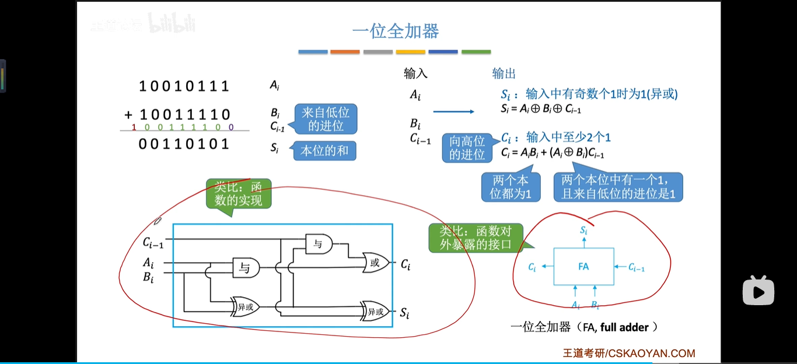

# 计算机组成原理-定点数表示

#### 定点数vs浮点数

###### 无符号数

- 整个机器字长的全部二进制位均为数值位，没有符号位，相当于数的绝对值。
- 表示范围 n位二进制数  0~2^n^-1

###### 有符号的定点表示

###### 原码

###### 反码

###### 补码

###### 移码

#### 原码、补码、移码作用

###### 加减法运算

#### 移位运算

**丢失精度**

##### 逻辑移位

##### 循环移位

##### 符号扩展

#### 原码一位乘法

##### 原码的除法

##### 数据存储和排列

##### 浮点数

##### IEEE 754 标准规范

##### 浮点数的加减运算

##### 算数逻辑单元ALU

###### 复合逻辑

###### 一位全加器

###### 串行加法器

###### 并行加法器

